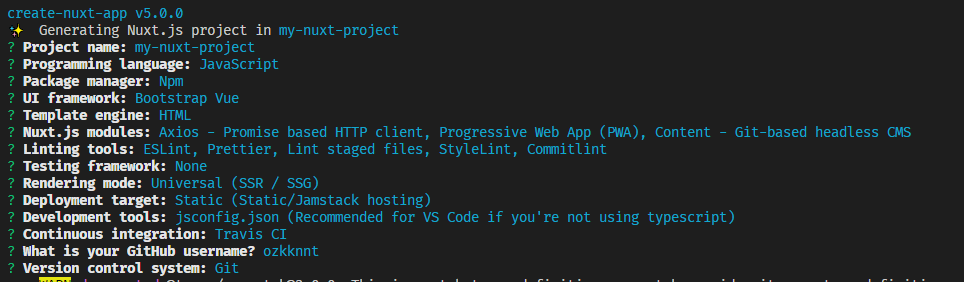

# nuxtapp
このページを参考に
https://qiita.com/Anderiens/items/a4c5783b5197de682329

```
https://github.com/ozkknnt/nuxtapp.git

cd nuxtapp

git branch gh-pages

```
```
C:\Programing\nuxtapp\nuxtapp>npm create nuxt-app my-nuxt-project
```

```
npm create nuxt-app my-nuxt-project
```


```
git config --global --unset credential.helper

git add --all

git push origin gh-pages
```

```
cd my-nuxt-project

npm run build
```

